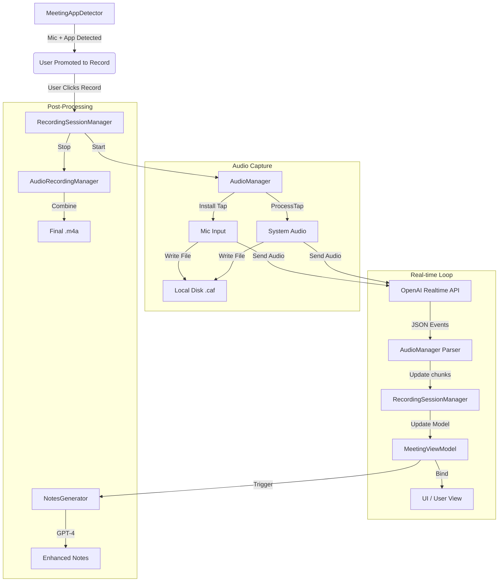

# System Flow Analysis: From Meeting to Real-time Feedback

This document outlines the technical flow of the application, tracing the path from detecting a meeting to displaying real-time feedback.

## 1. Meeting Detection
**Entry Point:** `Managers/MeetingAppDetector.swift`

*   **Mechanism:** The app runs a background monitor that checks two conditions:
    1.  **Microphone Activity**: `MicActivityMonitor` detects if the microphone is in use.
    2.  **Frontmost App**: `FrontmostAppMonitor` checks the currently active application.
*   **Trigger:** If the microphone is active AND the frontmost app is a known meeting tool (Zoom, Teams, Meet, Slack, etc.), a "Meeting" is detected.
*   **User Interaction:** A `MeetingReminderWindowController` overlay appears, prompting the user to "Record", "Ignore", or open "Settings".
*   **Action:** Clicking "Record" posts a `.createNewRecording` notification.

## 2. Starting the Session
**Coordinator:** `Managers/RecordingSessionManager.swift`

*   **Initialization:** Listens for `.createNewRecording` or manual start.
*   **Session Creation:** Calls `startRecording(for: meetingId)`.
*   **State Management:** Sets `isRecording = true` and manages the active `Meeting` object.

## 3. Audio Capture
**Core Engine:** `Managers/AudioManager.swift`

*   **Engine Setup:** Initializes an `AVAudioEngine`.
*   **Dual Capture:**
    *   **Microphone:** Installs a tap on the input node (`installTap`).
    *   **System Audio:** Uses `ProcessTap` to capture audio from specific running applications (Zoom, Teams, etc.) identified by `AudioProcessController`.
*   **Local Recording:**
    *   `AudioRecordingManager.swift` writes raw audio buffers to disk (`mic_*.caf` and `system_*.caf`) immediately.

## 4. Real-time Processing (The "Feedback" Loop)
**Provider:** OpenAI Realtime API (`wss://api.openai.com/v1/realtime?intent=transcription`)

*   **Connection:** `AudioManager` establishes a WebSocket connection to OpenAI.
*   **Streaming:** Audio buffers (Mic & System) are converted to 24kHz PCM, base64 encoded, and sent via WebSocket messages (`input_audio_buffer.append`).
*   **Response Parsing:** `AudioManager.receiveMessage` listens for events:
    *   `conversation.item.input_audio_transcription.delta`: Partial/Interim transcription updates.
    *   `conversation.item.input_audio_transcription.completed`: Finalized transcript segments.
*   **Feedback:** The "Real-time Feedback" is strictly **Live Transcription**. No other AI analysis (sentiment, coaching, etc.) happens in this real-time loop.

## 5. UI Updates
**Display:** `ViewModels/MeetingViewModel.swift` & `Views/MeetingView.swift`

*   **Data Binding:** `RecordingSessionManager` observes `AudioManager.transcriptChunks` and updates the active `Meeting` model.
*   **UI Refresh:** `MeetingViewModel` sees the updated `Meeting` and publishes changes.
*   **User View:** The user sees the transcript appear in real-time, separated by "Me" (Mic) and "Them" (System).

## 6. Post-Meeting Processing (After Stop)
*   **Audio Save:** `AudioRecordingManager` combines the `.caf` segments into a final `.m4a` file.
*   **Analytics:** `MeetingViewModel.calculateAnalytics()` analyzes the full transcript for Clarity, Conciseness, and Confidence scores.
*   **Audio Storage (Convex):**
    *   **Trigger:** Happens inside `generateNotes()` in `MeetingViewModel`.
    *   **Action:** `ConvexService.shared.uploadAudioFile` uploads the final `.m4a` recording to Convex's Object Storage.
    *   **Purpose:** Secure cloud backup of the audio for future reference or potentially advanced processing later.
*   **Enhanced Notes:** User can manually trigger "Pro Notes" generation (or auto-trigger), which uses `NotesGenerator.swift`.
    *   **Upload:** Audio file acts as a backup/reference (uploaded via `ConvexService.swift`).
    *   **Generation:** `NotesGenerator` calls OpenAI Chat Completion (GPT-4) with the full transcript to generate organized notes based on a template.

## Summary Diagram

